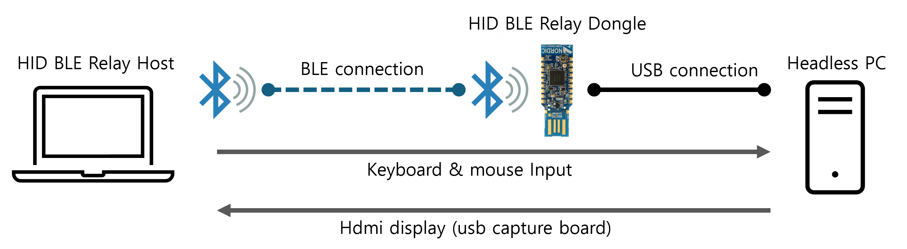

# HID BLE Relay Dongle

The **HID BLE Relay Dongle** is a firmware for the **nRF52840 Dongle** that bridges keyboard and mouse input from a Bluetooth-connected PC to a USB-connected server or headless system. It operates as a BLE peripheral and functions as a USB HID keyboard, seamlessly relaying inputs. Now you can control headless PC with your own laptop without relying on additional keybaord/mouse/dispaly. This project is like cheap kvm.


---

## Features

- **Bluetooth LE Peripheral**: Connects to a laptop using BLE.
- **USB HID Keyboard and Mouse**: Transmits keyboard inputs to a connected server or headless system via USB.
- **Custom UUID Support**: Uses custom Nordic UART Service (NUS) UUIDs for BLE communication.

---

## Custom BLE UUIDs

This firmware uses the following custom UUIDs for the Nordic UART Service:

- **Service UUID**: `597f1290-5b99-477d-9261-f0ed801fc566`
- **RX Characteristic UUID**: `597f1291-5b99-477d-9261-f0ed801fc566`
- **TX Characteristic UUID**: `597f1292-5b99-477d-9261-f0ed801fc566`

---

## Dependencies

- **Hardware**: nRF52840 Dongle
- **Software**: 
  - Zephyr RTOS (via Nordic Connect SDK)
  - **Nordic Connect SDK Version**: **2.8.0**

---

## Related Project: HID BLE Relay Host

To fully utilize this firmware, you can use the **HID BLE Relay Host**, a macOS application that complements this dongle by:
- Relaying keyboard & mouse inputs over BLE to this dongle.

Visit the **HID BLE Relay Host** repository for more information:
[HID BLE Relay Host](https://github.com/saga0619/HID_BLE_relay_host)
HID BLE Relay Host Captures HDMI video from a USB capture card, and send keyboard and mouse inputs to the HID BLE Relay dongle.
Cheap usb capture card is also good.

---

## Setup Instructions

### 1. Clone and Build the Firmware
Ensure you have Nordic Connect SDK version 2.8.0 installed and properly configured.

```bash
git clone https://github.com/saga0619/HID_BLE_relay_dongle.git
cd HID_BLE_relay_dongle
west build -b nrf52840dongle_nrf52840
```

### 2. Flash the Firmware
- Flash the firmware with nRF Connect::Programmer

### 3. BLE Connection
- Power on the nRF52840 Dongle and plug it into a USB port.
- Pair with a laptop or other BLE central device using the custom UUIDs.

### 4. USB HID Keyboard & Mouse
- Once connected, the dongle will act as a USB HID keyboard and mouse for the server or headless system.

---

## Acknowledgments

- Nordic Semiconductor's SDK and Zephyr RTOS
- HID BLE Relay Host for seamless integration
```
